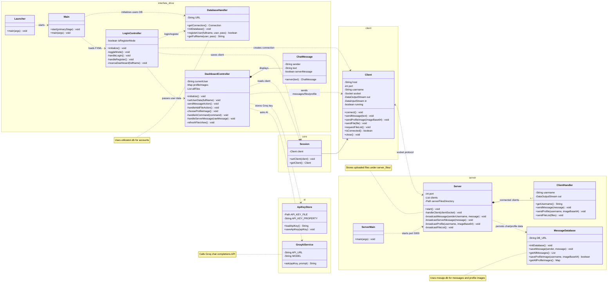

# FFShare UML Diagram

```mermaid
classDiagram
direction LR

namespace interfata_drive {
    class Launcher {
        +main(args) void
    }

    class Main {
        +start(primaryStage) void
        +main(args) void
    }

    class LoginController {
        -boolean isRegisterMode
        +initialize() void
        -toggleMode() void
        -handleLogin() void
        -handleRegister() void
        -incarcaDashboard(fullName) void
    }

    class DashboardController {
        -String currentUser
        -Map profileImages
        -List allFiles
        +initialize() void
        +setUserData(fullName) void
        -sendMessageAction() void
        -handleAddFileAction() void
        -chooseProfileImage() void
        -handleAiCommand(command) void
        -handleServerMessage(rawMessage) void
        -refreshFilesView() void
    }

    class DatabaseHandler {
        -String URL
        +getConnection() Connection
        +initDatabase() void
        +registerUser(fullname, user, pass) boolean
        +getFullName(user, pass) String
    }

    class ChatMessage {
        -String sender
        -String text
        -boolean serverMessage
        +server(text) ChatMessage
    }
}

namespace core {
    class Session {
        -Client client
        +setClient(client) void
        +getClient() Client
    }
}

namespace client {
    class Client {
        -String host
        -int port
        -String username
        -Socket socket
        -DataOutputStream out
        -DataInputStream in
        -boolean running
        +connect() void
        +sendMessage(text) void
        +sendProfileImage(imageBase64) void
        +sendFile(file) void
        +requestFileList() void
        +isConnected() boolean
        +close() void
    }
}

namespace server {
    class ServerMain {
        +main(args) void
    }

    class Server {
        -int port
        -List clients
        -Path serverFilesDirectory
        +start() void
        -handleClient(clientSocket) void
        -broadcastMessage(senderUsername, message) void
        -broadcastServerMessage(message) void
        -broadcastProfile(username, imageBase64) void
        -broadcastFileList() void
    }

    class ClientHandler {
        -String username
        -DataOutputStream out
        +getUsername() String
        +sendMessage(message) void
        +sendProfile(username, imageBase64) void
        +sendFileList(files) void
    }

    class MessageDatabase {
        -String DB_URL
        +initDatabase() void
        +saveMessage(sender, message) void
        +getAllMessages() List
        +saveProfileImage(username, imageBase64) boolean
        +getAllProfileImages() Map
    }
}

namespace ai {
    class ApiKeyStore {
        -Path API_KEY_FILE
        -String API_KEY_PROPERTY
        +loadApiKey() String
        +saveApiKey(apiKey) void
    }

    class GroqAiService {
        -String API_URL
        -String MODEL
        +ask(apiKey, prompt) String
    }
}

Launcher ..> Main : starts
Main ..> DatabaseHandler : initializes users DB
Main ..> LoginController : loads FXML

LoginController ..> DatabaseHandler : login/register
LoginController ..> Client : creates connection
LoginController ..> Session : saves client
LoginController ..> DashboardController : passes user data

DashboardController *-- ChatMessage : displays
DashboardController ..> Session : reads client
DashboardController ..> Client : sends messages/files/profile
DashboardController ..> ApiKeyStore : stores Groq key
DashboardController ..> GroqAiService : asks AI

Session --> Client
Client <..> Server : socket protocol
ServerMain ..> Server : starts port 5000
Server *-- "0..*" ClientHandler : connected clients
Server ..> MessageDatabase : persists chat/profile data

note for DatabaseHandler "Uses utilizatori.db for accounts"
note for MessageDatabase "Uses mesaje.db for messages and profile images"
note for Server "Stores uploaded files under server_files/"
note for GroqAiService "Calls Groq chat completions API"
```
